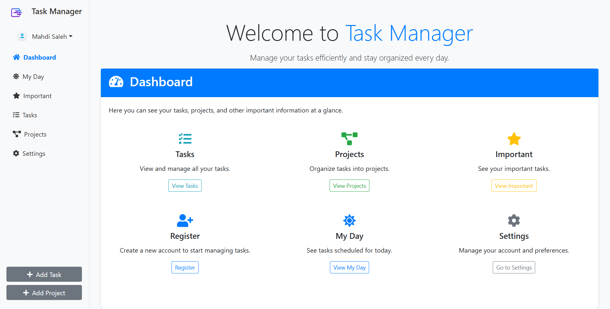

# Task Manager Web

This website is a full stack web built with HTML, CSS, JS and PHP. 
We used also AJAX for real refresh some parts in web pages without reloading the page.
The user should have an account to use this website, by entering the register page and fill the required form; then he login to the system and start using his task manager account.

The system have tasks to be saved on phpMyAdmin, MySQL DB; and tasks can be mentioned into a project. 
We have important page, that the priority of the task is HIGH; and we have created a My Day page; where the user can enter this page and check tasks that have due date in the same day date. 

User can modify, add and delete tasks, and the same for projects. 
Also, the user can modify his account and deactivate it without losing his data and tasks if he change his mind and want to reactivate it.
Check the folders, we have mentioned full code of our website and more images. 

To visit the website in live demo, click on the link: https://mahditaskmanager.ct.ws

